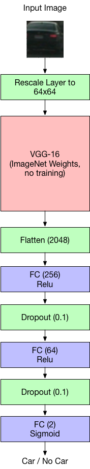

## Writeup Template
### You can use this file as a template for your writeup if you want to submit it as a markdown file, but feel free to use some other method and submit a pdf if you prefer.

---

**Vehicle Detection Project**

The goals / steps of this project are the following:

* Perform a Histogram of Oriented Gradients (HOG) feature extraction on a labeled training set of images and train a classifier Linear SVM classifier
* Optionally, you can also apply a color transform and append binned color features, as well as histograms of color, to your HOG feature vector.
* Note: for those first two steps don't forget to normalize your features and randomize a selection for training and testing.
* Implement a sliding-window technique and use your trained classifier to search for vehicles in images.
* Run your pipeline on a video stream (start with the test_video.mp4 and later implement on full project_video.mp4) and create a heat map of recurring detections frame by frame to reject outliers and follow detected vehicles.
* Estimate a bounding box for vehicles detected.

[//]: # (Image References)
[image1]: ./writeup_images/car_not_car.png
[image2]: ./examples/HOG_example.jpg
[image3]: ./writeup_images/search_grid.png
[image4]: ./writeup_images/pipeline.png
[image5]: ./writeup_images/pipeline2.png
[image6]: ./writeup_images/pipeline3.png
[image7]: ./examples/output_bboxes.png
[video1]: ./project_video.mp4

## [Rubric](https://review.udacity.com/#!/rubrics/513/view) Points
### Here I will consider the rubric points individually and describe how I addressed each point in my implementation.  

---
### Writeup / README

#### 1. Provide a Writeup / README that includes all the rubric points and how you addressed each one.  You can submit your writeup as markdown or pdf.  [Here](https://github.com/udacity/CarND-Vehicle-Detection/blob/master/writeup_template.md) is a template writeup for this project you can use as a guide and a starting point.  

You're reading it!

### Histogram of Oriented Gradients (HOG)

#### 1. Explain how (and identify where in your code) you extracted HOG features from the training images.

The code for this step is contained in the first code cell of the IPython notebook (or in lines # through # of the file called [Classifier Training and Single Image Pipeline.ipynb](https://github.com/SvenKratz/CarND-Vehicle-Detection-P5/blob/master/Classifier%20Training%20and%20Single%20Image%20Pipeline.ipynb).  

I started by reading in all the `vehicle` and `non-vehicle` images.  Here is an example of one of each of the `vehicle` and `non-vehicle` classes:

![alt text][image1]

##### Deep CNN for Feature extraction
Instead of using HOG features I used a VGG-16 Deep CNN for feature extraction, by chopping off the lower fully-connected layers. I chose VGG-16 because it is a well-established architecture with excellent performance on the ImageNet Database. I therefore thought it would perform well on the input images used in this assignment.

I used the ImageNet weights for VGG-16, and chose not to train VGG itself due to the limited size of the training dataset.

#### 3. Describe how (and identify where in your code) you trained a classifier using your selected HOG features (and color features if you used them).

Using features generated by VGG-16, I used a deep neural network for classification. The code for this is in the 2nd cell of the previously mentioned Jupyter Notebook.

I used two fully connected layers (256 and 64) with a fully connected final layer (2 dimensional) to output the final car / not car classification. I used dropouts to control overfitting and an Adam optimizer with a learning rate of (0.00001).

The following image shows the network architecture that I used:

For training, I used the provided training data set. However, as it only includes about 8000 examples of cars and only about half of that for non-cars, I used a simple data augmentation technique, doing a vertical mirroring, to get additional training data for the classifier. To balance car and non-car data sets, I simply duplicated the non-car data to approximately match the length of of the car data.

### Sliding Window Search

#### 1. Describe how (and identify where in your code) you implemented a sliding window search.  How did you decide what scales to search and how much to overlap windows?

I decided to use a sliding window search to find candidate pixel patches for vehicles. Because cars appear at different relative sizes in the image, depending on how far they are from the camera, I implemented three sliding window search grids at multiple scales: 32x32 for distant vehicles, 64x64 in the mid-field, 128x128 and 196x196 in the near field. The following image shows a visual representation of the search grid:

![alt text][image3]

#### 2. Show some examples of test images to demonstrate how your pipeline is working.  What did you do to optimize the performance of your classifier?

To improve the classifier, I tried out several different NN architectures.

1. Single, large FC layer (512)
2. Multiple large FC layers (512, 256)
3. Medium and small FC layers (256, 32)

It turned out that reducing the number of trainable parameters lead to higher detection accuracy, possibly because of the small amount of data. Therefore, option (3) worked best, with a medium (256 neurons) FC layer followed by a relatively smaller one (64 neurons). I also experimented with the learning rate for the Adam classifier, and found that reducing it significantly (to 0.00001) allowed me to train more epochs and reduced overfitting effects. I also added Dropouts to mitigate overfitting.

Here is a demonstration output from my pipeline:

![alt text][image4]

Image description from left to right:
* candidate bounding boxes
* heat map
* threshold image
* car bounding boxes drawn on output image

---

### Video Implementation

I implemented the video vehicle detection pipeline in the Jupyter notebook called [Vehicle Video Detection Pipeline.ipynb](https://github.com/SvenKratz/CarND-Vehicle-Detection-P5/blob/master/Vehicle%20Video%20Detection%20Pipeline.ipynb).

#### 1. Provide a link to your final video output.  Your pipeline should perform reasonably well on the entire project video (somewhat wobbly or unstable bounding boxes are ok as long as you are identifying the vehicles most of the time with minimal false positives.)

Here's a [link to my video result](./car_detect_output.mp4)

#### 2. Describe how (and identify where in your code) you implemented some kind of filter for false positives and some method for combining overlapping bounding boxes.

I recorded the positions of positive detections in each frame of the video.  From the positive detections I created a heatmap and then thresholded that map to identify vehicle positions.  I then used a connected component algorithm on the threshold image (`cv2.connectedComponentsWithStats`) to identify individual blobs in the heatmap.  I then assumed each labeled blob corresponded to a vehicle.  `cv2.connectedComponentsWithStats` provides bounding boxes and area statistics to describe each detected blob.

Here's an example result showing the heatmap from a series of frames of video, the result of `scipy.ndimage.measurements.label()` and the bounding boxes then overlaid on the last frame of video:

### Here are three example frames and their corresponding heatmaps, threshold images and drawn bonding boxes:

![alt text][image4]

![alt text][image5]

![alt text][image6]

#### Vehicle Detection Pipeline Refinements

Firstly, new bounding boxes provided by `cv2.connectedComponentsWithStats` are only accepted as candidate car bounding boxes, if their area is above a certain size.

Secondly, to further refine the detection pipeline, and to mitigate false positives, I implemented a `Car()` class. The class is implemented in the cell with the headline "Vehicle Detection Tracking and Filtering" and handles the following aspects:

* tracks car detections over time and maintains a filter queue for the time sereis of detections
* provides a filtered value of the bounding box coordinates between detections using a 1D Gaussian filter
* defines a "lifetime for a detection": if the car is not detected after 8 frames, it will get deleted from a master list of detected cars. The lifetime value gets decremented each time a car is not found within a frame. If lifetime reaches 0, the car is deleted from the master list.
* the `find_corresponding(cars, window)` function of `Car()` class provides a method to find the car from a list that most closely matches a given bounding box, using a simple distance matching metric

---

### Discussion

#### 1. Briefly discuss any problems / issues you faced in your implementation of this project.  Where will your pipeline likely fail?  What could you do to make it more robust?

Overall, given the assignment parameters, I believe I did a good job fine-tuning the parameters (grid layout, thresholding, small area rejection) and implementing the Car() class helped preserve detection semantics between video frames. However, there are numerous improvements to the pipeline that I can think of:

To recap, I opted not to use HOG feature but chose an alternative approach of using a pre-trained image classification CNN to generate image features. Also, I used a DNN rather than an SVM to perform image classification. The performance of the classifier here may suffer from a lack of training data compared to the SVM, so to improve classification, a larger training set needs to be used.

We can see that the classifier could be improved, as bounding boxes generate by the pipeline are slightly noisy. Also, there are right now a few too many false positive detections, so the training set of "not car" also needs to be expanded.

Bounding box generation could also be improved by applying dynamic thresholding, rather than the fixed variant I'm currently using, as cars may not always be detected with equal intensity in all scenes.

A further problem I noticed is occlusion, e.g., when the dark car passes in front of the white car, the dark car detection takes precedent. A more sophisticated algorithm might be able to do a second pass on the bounding box of the foreground car to extract other cars that are being occluded.
